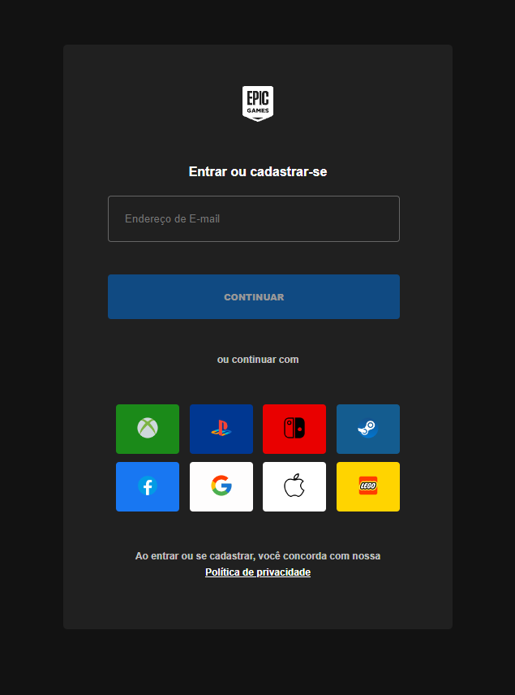

<h1 align="center"> Projeto Register </h1>

Projeto criado e projetado por mim.

  <a href="#-tecnologias">Tecnologias</a>&nbsp;&nbsp;&nbsp;|&nbsp;&nbsp;&nbsp;
  <a href="#-projeto">Projeto</a>&nbsp;&nbsp;&nbsp;|&nbsp;&nbsp;&nbsp;
  <a href="#-licença">Licença</a>

  

 

  

## 🚀 Tecnologias

Esse projeto foi desenvolvido com as seguintes tecnologias:

- HTML e CSS
- Git e Github

## 💻 Projeto

O projeto Register é um projeto criado para treinar as tecnologias como: HTML e CSS, assim sendo desenvolvido com base na tela de registro ou entra da Epic Games(projeto criado desde o zero por mim). Acesse o projeto [AQUI](https://yuriverwiebe.github.io/projeto-register)

## 📝 Licença

Esse projeto está sob a licença MIT.

---

Feito com ♥ by Yuri Verwiebe 🌊
